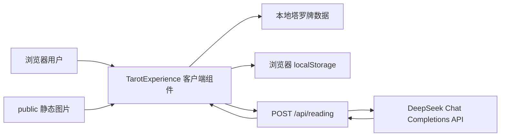

# 塔罗牌 WebApp 项目重启技术评估报告

> 评估日期：2026-09-09
>
> 评估对象：`D:\毕业设计\塔罗牌WebApp` 代码仓库当前 `main` 分支
>
> 基准提交：`4792b91 优化牌堆阴影层次`
>
> 报告性质：项目重启前的全量技术尽调、完成度判断与后续建设建议

---

## 1. 执行摘要

### 1.1 一句话结论

该项目已经完成了一个具有较高视觉辨识度、桌面端核心占卜流程基本可演示的 MVP，但当前更接近“可展示的毕业设计 DEMO”，还不是“可稳定发布和持续迭代的 Web 产品”。

### 1.2 当前所处阶段

建议将当前阶段定义为：

> **桌面端交互原型已完成，正在进入工程基线修复、移动端适配和发布准备阶段。**

它已经越过了“项目骨架”“静态视觉稿”“功能概念验证”三个早期阶段，具备以下真实能力：

- 完整 78 张塔罗牌数据和 Rider-Waite-Smith 牌面素材。
- 首页提问、仪式转场、鼠标扰动洗牌、弧形牌带、拖拽三张牌。
- 正逆位随机、逐张 3D 翻牌、分段打字机文本展示。
- Next.js 服务端 API Route 调用 DeepSeek。
- API 错误分类、超时、失败后保留牌局和手动重试。
- 命运手记、本地保存和历史列表。
- 成熟度较高且风格统一的“旧女巫木桌”桌面端视觉。

但项目重启时不能直接继续堆叠视觉功能，因为目前存在几个会影响后续所有工作的基础问题：

1. `package-lock.json` 与依赖声明不同步，`npm ci` 无法执行，新环境不可可靠复现。
2. Next.js 14.2.23 已被当前安全审计标记为关键风险版本。
3. `/api/reading` 没有频率限制、身份约束和成本保护，部署到公网后可被滥用消耗 API 余额。
4. 移动端只做了局部缩放，没有完成真正的响应式交互设计，核心抽牌流程在手机宽度下布局失真。
5. 约千行的 `TarotExperience.tsx` 集中了状态机、动画、业务流程、请求、存储和多个界面，继续叠加功能会快速增加回归风险。
6. 没有自动化测试、CI、部署配置、监控或错误追踪。
7. 当前 DeepSeek 真实请求因账户余额不足而返回 503，在线 AI 主链路暂时不可用。

### 1.3 完成度判断

完成度必须按目标口径拆开看：

| 评估口径 | 当前完成度 | 判断 |
| --- | ---: | --- |
| 毕业设计桌面端演示 DEMO | **约 75%** | 核心故事线已经成立，补齐 AI 可用性、关键布局问题和演示稳定性后可用于答辩演示 |
| 原计划第一版 MVP 功能 | **约 70%** | 主流程已完成，但移动端、阅读特效、历史管理细节和真实在线稳定性尚未完成 |
| 工程化与可维护性 | **约 45%** | 有 TypeScript、Lint、构建和清晰文档，但依赖不可复现、组件过度集中、无测试和 CI |
| 可公开部署的产品状态 | **约 30%** | 安全、成本控制、隐私告知、移动端、可观测性和运维均不足 |
| 综合产品化完成度 | **约 55%** | 视觉和核心体验领先，工程、安全、响应式和发布能力明显落后 |

这个百分比不是工时的机械换算，而是基于功能、体验、工程、安全、测试、发布等维度的加权判断。

### 1.4 建议的总策略

当前最合理的方向不是立刻重写，也不是继续优先添加特效，而是：

1. **先恢复可复现、可验证的工程基线。**
2. **修复会阻断演示或造成公网风险的问题。**
3. **补齐移动端和无障碍的最小可用版本。**
4. **在行为测试保护下拆分核心组件。**
5. **最后继续完成标题、揭牌光效和视觉打磨。**

不建议当前立即加入账号、数据库、支付、多牌阵或后台管理。这些功能会扩大毕业设计范围，但不能解决现阶段最关键的稳定性问题。

---

## 2. 评估范围与方法

### 2.1 已检查内容

本次评估覆盖：

- Git 分支、提交历史、工作区状态和远程差异。
- 根目录工程配置、依赖声明、锁文件和忽略规则。
- `src/app/` 页面、布局、全局样式和 API Route。
- `src/components/` 全部组件。
- `src/data/` 78 张塔罗牌数据。
- `src/lib/` 随机抽牌、本地存储和 DeepSeek 调用。
- `src/types/` 业务类型。
- `public/assets/` 背景与卡背。
- `public/cards/rws/` 全部 78 张牌面。
- `ProjectDocument/` 下的交接、产品、视觉、动效和 DEMO 文档。
- 桌面端和移动端真实浏览器流程。
- Lint、TypeScript 类型检查、生产构建、依赖树和安全审计。
- API 正常校验、真实上游错误和前端失败重试流程。

### 2.2 实际执行的验证

| 验证项 | 结果 | 说明 |
| --- | --- | --- |
| `npm ci` | **失败** | 锁文件不同步，出现 `@emnapi/wasi-threads` 版本不满足以及缺失包记录 |
| 临时恢复本机依赖 | **成功** | 使用 `npm install --package-lock=false`，只用于本次验证，没有更新锁文件 |
| `npm run lint` | **通过** | 依赖临时恢复后通过 |
| `npm run typecheck` | **通过** | TypeScript strict 模式下通过 |
| `npm run build` | **通过** | Next.js 生产构建成功 |
| `npm run check` | **通过** | 在临时恢复依赖后，Lint、类型检查和构建全部通过 |
| 首页桌面端 | **通过** | 1280×720 下主要视觉完整，无页面滚动 |
| 桌面端主交互 | **部分通过** | 提问、洗牌、抽三张牌和错误处理可用 |
| DeepSeek 真实调用 | **失败但错误处理正确** | 上游返回余额不足，前端显示中文提示并保留重试入口 |
| 阅读与终局流程 | **通过模拟响应验证** | 使用浏览器网络拦截返回结构化测试数据，没有修改源码 |
| localStorage 保存/读取 | **通过** | 记录结构和 20 条上限逻辑存在 |
| 非法 localStorage 数据 | **失败** | 合法 JSON 但结构错误时，打开历史会触发 `records.map is not a function` 并导致页面错误 |
| 移动端首页 | **部分可见** | 390×844 下标题和牌堆可见，但底部控件互相遮挡 |
| 移动端抽牌页 | **不合格** | 三列固定牌位与巨大牌带没有移动端布局，提示和历史入口被遮挡/挤出 |
| API 非法请求 | **通过** | 空对象 POST 返回 400 和结构化 `INVALID_REQUEST` |
| API GET | **通过框架默认行为** | 返回 405 |
| 密钥暴露检查 | **通过** | `.env.local` 被 Git 忽略，静态客户端产物中未发现 `DEEPSEEK_API_KEY` 引用 |

### 2.3 本次评估限制

- DeepSeek 账户余额不足，因此没有完成一次真实成功的 AI 解读；后半流程使用了与接口类型一致的浏览器级模拟响应。
- 没有对线上部署环境进行测试，因为仓库中没有已配置的部署目标或线上地址。
- 没有执行长时间压力测试、真实弱网测试和多用户并发测试。
- 没有覆盖 Safari/iOS 真机；移动端结论来自 390×844 浏览器视口和源码检查。
- 没有对所有塔罗牌中文含义做专业塔罗知识审核，只检查了结构、数量、资源路径和工程使用方式。

---

## 3. 仓库与版本控制状态

### 3.1 Git 概况

| 项目 | 当前状态 |
| --- | --- |
| 当前分支 | `main` |
| 当前提交 | `4792b91 优化牌堆阴影层次` |
| 总提交数 | 54 |
| 相对 `origin/main` | 本地领先 1 个提交 |
| 最近一次提交时间 | 2026-07-02 10:52:34 +0800 |
| 已跟踪文件 | 109 个 |
| 当前用户未跟踪文件 | `ProjectDocument/毕业设计开题报告(模板).docx` |

判断：

- 提交粒度总体较细，视觉调整有连续版本记录，适合回溯。
- 当前本地 `main` 比远程领先 1 个提交，说明上次工作没有完全同步到远程。
- 未跟踪的开题报告模板属于用户文件，本次评估不修改、不纳入提交。
- 仓库没有标签和正式版本号策略；`package.json` 仍为 `0.1.0`。

### 3.2 版本控制优点

- `.env.local`、构建目录、缓存、日志、浏览器测试输出均已忽略。
- 最近多次视觉调整都有单独提交，历史可理解。
- 工程文档要求变更后同步更新交接文档，团队意识是正确的。

### 3.3 版本控制问题

- 本地主分支直接开发，没有功能分支或 Pull Request 评审痕迹。
- 远程少 1 个提交，交接时容易产生“本地是最新还是远程是最新”的歧义。
- 没有 GitHub Actions 或其他 CI，提交是否可构建完全依赖人工。
- 没有发布标签、CHANGELOG 或演示版本冻结点。

建议项目恢复后建立至少三类节点：

- `baseline-recovery`：依赖、安全和测试基线恢复。
- `demo-stable`：答辩可稳定演示的冻结版本。
- `v1.0.0`：正式毕业设计提交或公开部署版本。

---

## 4. 项目定位与产品范围

### 4.1 当前产品定位

项目定位清楚：以“旧女巫木桌”为核心视觉，用真实塔罗牌、物理式洗牌和大模型文本解读构建沉浸式三牌占卜体验。

当前用户路径非常聚焦：

```text
输入问题
  ↓
仪式转场
  ↓
鼠标扰动洗牌
  ↓
底部弧形牌带
  ↓
拖拽过去 / 现在 / 未来三张牌
  ↓
服务端请求 DeepSeek
  ↓
逐张翻牌与文字揭示
  ↓
命运手记
  ↓
localStorage 历史保存
```

### 4.2 当前明确不做的范围

文档已明确不包含：

- 用户登录和账号体系。
- 多用户数据库。
- 跨设备历史同步。
- 多种复杂牌阵。
- 后台管理系统。
- 支付和商业化。

这个范围对毕业设计是合理的。当前最大风险不是功能太少，而是已有体验在工程稳定性和移动端上没有闭环。

### 4.3 产品价值与创新点

项目真正有辨识度的部分有三点：

1. 不是简单点击随机抽牌，而是有可操作的洗牌和拖拽过程。
2. 视觉、动效、牌面和文案语气高度统一，已经形成明确的作品气质。
3. AI 解读与牌阵位置、正逆位和关键词结合，具备完整输入输出链路。

毕业设计答辩时应重点展示这三点，而不是把重点放在普通 CRUD 或账号体系上。

---

## 5. 技术架构现状

### 5.1 总体架构



架构特点：

- 单页、单主流程、无数据库，系统复杂度低。
- API Key 位于服务端环境变量，边界方向正确。
- 浏览器持有全部 UI 状态和本地历史。
- Next.js 同时承担静态页面服务和 AI 代理接口。

### 5.2 技术栈

| 层面 | 当前技术 |
| --- | --- |
| 框架 | Next.js 14.2.23 App Router |
| UI | React 18.3.1 |
| 语言 | TypeScript，`strict: true` |
| 样式 | Tailwind CSS 3 + 全局 CSS |
| 动画 | Framer Motion 12 |
| 图标 | Lucide React |
| AI | DeepSeek OpenAI 兼容 Chat Completions |
| 数据存储 | 浏览器 localStorage |
| 包管理 | npm + `package-lock.json` |
| 测试 | 未配置 |
| 部署 | 未配置 |

### 5.3 页面与 API

当前仅有三个 Next.js 路由：

| 路由 | 类型 | 状态 |
| --- | --- | --- |
| `/` | 静态页面 | 已实现 |
| `/_not-found` | 框架生成 | 正常 |
| `/api/reading` | 动态服务端 API | 已实现，缺少公网保护 |

生产构建结果：

- 首页自身产物：55.4 kB。
- 首页 First Load JS：143 kB。
- 共享 First Load JS：87.1 kB。
- 首页可静态预渲染。
- `/api/reading` 按请求动态执行。

对于一个动画较多的单页应用，这个 JavaScript 体积尚可，但首屏背景图片仍偏大。

---

## 6. 代码结构与模块评估

### 6.1 核心文件清单

| 文件 | 责任 | 规模/评价 |
| --- | --- | --- |
| `src/components/TarotExperience.tsx` | 页面状态机、全部主流程、绝大部分 UI 和动画 | 约千行，当前最大维护风险 |
| `src/components/AmbientLightEffects.tsx` | 分阶段环境光和尘埃 | 职责相对单一，可维护性较好 |
| `src/app/globals.css` | 全局基线、背景、环境光、标题、羊皮纸、牌面辅助样式 | 约 500 行，缺少移动端体系 |
| `src/app/api/reading/route.ts` | 请求解析、结构校验、错误响应 | 结构清晰，但校验与防滥用不足 |
| `src/lib/deepseek.ts` | 上游调用、Prompt、超时、错误映射、响应解析 | 边界较清楚，仍有输入信任问题 |
| `src/lib/storage.ts` | localStorage 读取、写入、清空 | 简单，但没有运行时结构校验和写入错误处理 |
| `src/lib/tarot.ts` | 随机牌序、正逆位、标签 | 简单；洗牌算法可更严谨 |
| `src/data/tarotCards.ts` | 22 张大阿卡纳与程序生成的 56 张小阿卡纳数据 | 数量完整，数据语义较通用 |
| `src/types/*.ts` | 塔罗牌、请求响应、历史记录类型 | 清晰，类型只在编译期生效 |

### 6.2 做得较好的部分

- TypeScript 开启严格模式，当前类型检查通过。
- API 错误使用统一 code、message、retryable 结构，前端能按是否可重试显示提示。
- DeepSeek 调用包含 30 秒超时和 AbortController。
- DeepSeek 返回内容经过 JSON 解析和四个字段非空校验。
- 前端请求也再次校验返回结构，具有双层防御。
- 抽牌结果保存了牌位、卡牌 ID、正逆位和对应解读，结构可用于后续展示。
- 动画性能已经考虑 `requestAnimationFrame` 节流、组件 memo 和避免为 78 张牌同时加重阴影。
- 真实牌面没有一次性在首页全部下载；首页虽然渲染 78 个相同卡背 ``，网络层只请求一次卡背资源。
- 逆位状态能在翻牌、阅读和终局动画中保持一致。

### 6.3 当前主要代码债务

#### A. 单体组件过大

`TarotExperience.tsx` 同时承担：

- 应用状态机。
- 问题表单。
- 牌堆初始化。
- 洗牌物理计算。
- 拖拽落点判断。
- AI 请求状态。
- 错误展示。
- 翻牌顺序。
- 终局过渡。
- localStorage 保存。
- 历史弹窗。
- 五类以上卡牌/UI 子组件。

当前 12 个 React 状态、多个 ref、多个 timeout 和大量阶段条件渲染互相耦合。任何布局或流程变更都可能影响其他阶段。

建议拆分，但不建议一次性重写。先补流程测试，再按边界迁移：

1. `useTarotRitualState` 或 reducer：管理状态转换。
2. `TarotDeck`：管理 stack/shuffle/fan/draw 布局。
3. `QuestionStage`、`DrawStage`、`ReadingStage`、`FinalJournal`。
4. `HistoryDialog`。
5. `useReadingRequest` 和 `useReadingHistory`。

#### B. 状态机只有类型，没有转换约束

`AppStage` 是字符串联合类型，但阶段变化通过散落在组件内的 `setStage` 和 timeout 完成。当前没有：

- 合法转换表。
- 阶段进入/退出动作。
- 可取消的统一转场计时器。
- 对重复点击或快速操作的系统性保护。

这会使未来增加返回、跳过动画、恢复牌局或移动端替代操作变得困难。

#### C. 本地存储没有运行时校验

`readReadingRecords()` 直接把 `JSON.parse` 结果断言为 `ReadingRecord[]`。TypeScript 断言不会验证浏览器中的真实数据。

已实测：把 localStorage 设置为合法 JSON `{}` 后，首页仍可打开，但点击历史记录会因 `records.map is not a function` 触发 React 页面错误。

应增加：

- 是否为数组。
- 每条记录的核心字段类型。
- `spread` 是否为数组且牌位合法。
- 非法数据的降级策略，例如忽略、迁移或提示清理。
- `setItem` 的异常捕获和用户提示。

#### D. 随机牌序算法不够规范

当前 `drawRandomDeck()` 使用“给每张牌一个 `Math.random()` 再排序”。对于 78 张牌和视觉 DEMO，性能不是问题，但随机排序的统计分布和排序实现相关，不如 Fisher-Yates 明确。

建议后续改为 Fisher-Yates，并为“78 张不重复”“抽三张不重复”“正逆位值合法”补单元测试。

#### E. 存在未使用或语义不完整的代码

- `CardFront` 接收 `orientation`，但组件内部未使用该参数。
- `clearReadingRecords()` 已导出但 UI 没有调用。
- `.table-surface`、`.ritual-atmosphere`、`.writing-mode-vertical` 等样式看起来是早期实现遗留。
- 文档建议的 `TarotDeck`、`CardRevealEffects`、多个 hook 尚未落地。

这些不是当前最优先 Bug，但说明代码已经开始出现“文档架构领先于实际架构”的现象。

---

## 7. 功能完成度矩阵

| 功能 | 状态 | 评估 |
| --- | --- | --- |
| 黑屏/暗场入场 | 已实现 | 700ms 后进入问题阶段，基础效果存在 |
| 问题输入 | 已实现 | 空内容禁用按钮，但没有长度上限和敏感场景告知 |
| 首页视觉 | 基本完成 | 桌面端完成度较高，移动端底部区域冲突 |
| 标题单字乱序入场 | 未实现 | 文档已设计，DOM 已拆字，尚未接动画 |
| 仪式转场 | 部分实现 | 仍名为 `camera-lift`，背景保留 `rotateX`，与最新设计决策不一致 |
| 78 张真实牌堆 | 已实现 | 首页与洗牌共用同一批 deck 数据 |
| 鼠标扰动洗牌 | 已实现 | 桌面端可用，未形成 `shuffle-ready`/`shuffle-active` 分层 |
| 触摸洗牌 | 未验证/提示缺失 | 文案只写“鼠标轨迹”，移动端体验未设计 |
| 底部弧形牌带 | 已实现 | 桌面端视觉明显；1280 宽时遮到右下历史按钮 |
| 拖拽三张牌 | 桌面端已实现 | 只能拖拽，没有点击选择、键盘选择或移动端替代操作 |
| 过去/现在/未来顺序 | 已实现 | 根据已放置数量强制顺序 |
| 正逆位 | 已实现 | 50/50 随机，视觉状态能跨阶段保持 |
| DeepSeek 服务端代理 | 已实现 | 密钥不下发客户端，返回与错误有校验 |
| DeepSeek 真实可用性 | 当前不可用 | 实测账户余额不足，返回 503 |
| API 失败保留牌局 | 已实现 | 实测正确，允许手动重试 |
| 逐张 3D 翻牌 | 已实现 | 通过模拟响应完成全流程验证 |
| 真实流式输出 | 未实现 | 实际是一次性 JSON 返回后前端 30ms/字打字机显示 |
| 当前牌聚光/边缘光/金粉 | 未实现 | 最新动效文档明确列为待办 |
| 阅读布局防遮挡 | 未完成 | 实测解读面板覆盖牌面下部 |
| 命运手记 | 已实现 | 三张牌、问题、分段解读、总结完整 |
| 保存手记 | 已实现但较粗糙 | 无保存成功反馈、无防重复保存；连续点击会生成重复记录 |
| 历史列表 | 部分实现 | 能显示时间、问题和摘要；不能打开详情、删除、清空或导出 |
| 终局打开历史 | 存在 Bug | 手记层拦截指针，右下“历史记录”按钮无法点击 |
| 再次占卜 | 已实现 | 重置牌局并生成新 deck，问题文本保留 |
| 多语言 | 未实现 | 当前仅中文，符合现阶段范围 |
| 登录/数据库 | 明确不做 | 对毕业设计 MVP 合理 |

---

## 8. 用户体验与视觉评估

### 8.1 桌面端优点

1280×720 实测下，首页已经具备较强的成品感：

- 木桌、蜡烛、羽毛笔、旧书、牌堆和羊皮纸形成稳定构图。
- 主标题层级明确，暗金配色和背景融合良好。
- 中央牌堆与问题输入区没有重叠。
- 洗牌、收拢、牌带和拖拽形成连续叙事。
- 牌面复古滤镜统一，正面与自定义卡背风格能衔接。
- AI 错误文案没有破坏角色氛围，同时保留可理解性。

这部分是项目当前最成熟、最值得保留的资产。

### 8.2 桌面端已确认问题

#### 阅读面板遮挡牌面

三张牌固定使用同一个 `top-[24%]`，`draw` 和 `reading` 没有分开布局。底部阅读面板从下方升起后覆盖牌面下部，与交接文档中的已知问题一致。

#### 历史按钮层级和可点击性不稳定

- 抽牌阶段右下历史按钮会被最右侧牌带视觉压住。
- 终局阶段按钮仍渲染，但命运手记层位于更高 z-index 并覆盖点击区域；自动化点击明确报告手记层拦截指针事件。

建议在 `final` 阶段隐藏全局历史按钮，或把历史入口整合进手记标题栏。

#### 历史记录信息不足

历史弹窗只展示摘要，记录卡片不可点击。用户保存后无法重新查看完整三张牌和解读，也不能管理记录。

#### 保存交互缺少反馈

保存按钮不会变为“已保存”，也不会禁用；重复点击会创建多条不同 ID 的相同记录。

### 8.3 移动端结论

390×844 实测表明，项目目前不能宣称“支持移动端”：

- 首页背景使用 `cover` 后两侧关键道具被裁切，这是可以接受的；但标题、牌堆、羊皮纸和底部按钮占满纵向空间。
- “已保存 N 条命运手记”和右下历史按钮与羊皮纸底部、开始按钮互相重叠。
- 抽牌页仍使用三列布局、`h-72 w-44` 固定牌框和 1100px 宽的牌带。
- 三个牌位在窄屏上互相挤压/覆盖，文字和边框层次失真。
- 牌带占据屏幕下半部，抽牌提示和历史入口不可见或被遮挡。
- 页面全局 `overflow: hidden`，用户无法通过滚动弥补内容溢出。
- 核心动作只有拖拽，没有为触摸误操作、窄屏命中区和点击选牌提供替代方案。

建议不要只做 CSS 缩放。移动端应该设计为不同布局：

- 三个牌位横向缩小或改为单行可滚动/分步单牌槽。
- 牌带减小尺寸和展开半径。
- 支持“点击一张牌，再点击当前牌位”作为拖拽替代。
- 底部固定操作区使用安全区 `env(safe-area-inset-bottom)`。
- 主容器改用 `100dvh`/`min-height: 100dvh`，处理移动浏览器地址栏。

### 8.4 可访问性

当前可访问性属于早期状态：

优点：

- 页面语言为 `zh-CN`。
- 主标题保留完整 `aria-label`。
- 牌面图片有中英文 alt。
- 装饰卡背被标记为 `aria-hidden`。
- CSS 环境光针对 `prefers-reduced-motion` 停止动画。

问题：

- 抽牌只能用指针拖拽，键盘和辅助技术无法选择卡牌。
- 历史弹窗没有 `role="dialog"`、`aria-modal`、标题关联、焦点锁定和 Escape 关闭。
- 状态切换和 API 解读完成没有可靠的 live region 通知。
- 没有显式 `:focus-visible` 样式。
- reduced-motion 只处理全局 CSS 环境光，Framer Motion 的位移、翻牌和共享布局动画仍会执行。
- 页面使用大量低透明度金棕色小字，部分文字可能达不到常规对比度要求。
- 固定全屏且禁止滚动，对字体放大和小屏幕用户不友好。

---

## 9. AI 接口与业务完整性

### 9.1 当前调用流程

1. 浏览器从本地 `tarotCardMap` 取三张牌的名称、关键词和含义。
2. 浏览器把问题和完整卡牌语义 POST 到 `/api/reading`。
3. API Route 做结构校验。
4. `requestDeepSeekReading()` 从服务端环境变量读取 Key、Base URL 和模型。
5. 服务端构造 system/user prompt，请求 `/chat/completions`。
6. DeepSeek 返回 JSON 字符串。
7. 服务端解析四个字段并返回浏览器。
8. 浏览器再次校验字段并逐字显示。

### 9.2 当前优点

- API Key 只在服务端读取。
- `.env.local` 已被 Git 忽略。
- 客户端静态构建中没有发现 `DEEPSEEK_API_KEY` 引用。
- 失败时不伪造本地解读，产品行为诚实。
- 认证失败、余额不足、限流、超时、上游错误和格式错误有独立错误码。
- Prompt 明确禁止绝对预言，并对医疗、法律、财务和人身安全问题要求专业提醒。
- 正逆位在发送前只选取当前方向关键词，降低模型方向混淆。

### 9.3 关键问题

#### 服务端信任客户端传入的卡牌语义

API 只校验 `nameCn`、`nameEn`、`meaning` 和关键词是不是字符串，却不校验它们是否与仓库中的卡牌 ID 一致，事实上请求体里甚至没有 `cardId`。

攻击者可以绕过前端直接调用 API，把任意长文本或指令放进牌名、关键词和含义，再由服务端转发给 DeepSeek。这会带来：

- 牌义完整性被篡改。
- Prompt 注入面扩大。
- Token 成本不可控。
- 服务端无法证明返回解读基于真实抽牌结果。

建议把请求体收敛为：

```ts
{
  question: string;
  cards: Array<{
    cardId: string;
    position: "past" | "present" | "future";
    orientation: "upright" | "reversed";
  }>;
}
```

服务端根据 `cardId` 从可信的 `tarotCards` 数据中重新取牌名、关键词和含义。

#### 缺少长度和规模限制

当前只要求问题非空，没有限制：

- `question` 长度。
- 牌名、含义和单个关键词长度。
- 关键词数组元素数量。
- 请求总体大小。

应在浏览器和服务端同时限制问题长度，例如 300～500 个字符；卡牌语义改为服务端取值后，可消除大部分客户端膨胀输入。

#### 缺少频率限制和成本保护

任何能访问部署地址的人都可以直接重复 POST `/api/reading`。当前没有：

- IP/会话频率限制。
- 验证码或匿名会话令牌。
- 每日额度。
- 并发限制。
- 预算告警。
- 请求审计指标。

这在本地演示时不明显，但一旦公网部署，最直接的风险是 API 余额被消耗。

#### 真实上游当前不可用

本次真实请求收到 `DEEPSEEK_INSUFFICIENT_BALANCE`，HTTP 503。前端错误处理正确，但毕业答辩或公开演示前必须解决：

- 充值或替换为可用模型/账户。
- 进行一次真实成功请求回归。
- 准备演示环境健康检查。
- 决定是否允许“演示模式”。若增加演示模式，必须显式标注，不能伪装成在线解读。

### 9.4 一次性响应与“流式”表述

当前系统不是 DeepSeek 流式传输。服务端一次性获得 JSON，浏览器再用定时器模拟逐字出现。

这对三牌结构化输出是合理的，也比真正流式 JSON 更容易保证完整性。但项目说明中部分地方写“AI 流式解读”，应统一改为：

> “一次性结构化 AI 响应 + 前端分段打字机揭示。”

如果论文要讨论流式通信，则需要真正实现 SSE/ReadableStream；否则应避免把当前实现描述成网络流式响应。

---

## 10. 数据与存储评估

### 10.1 塔罗牌数据

数据总量正确：

- 22 张大阿卡纳。
- 4 个花色 × 14 张小阿卡纳，共 56 张。
- 合计 78 张。
- `tarotCardMap` 提供按 ID 查找。

牌面资源检查结果：

- `public/cards/rws/` 中有 78 个 JPG。
- 全部为 350×600。
- 未发现完全相同哈希的重复图片。
- 单图约 74～127 KB。
- 牌面总计约 7.73 MB。

注意：小阿卡纳的关键词和含义由统一 rank + suit 模板生成，工程上完整，但专业塔罗语义较泛化。若毕业论文强调“塔罗知识库”，建议后续逐牌补充更具体的正位、逆位和情境含义，或明确说明当前采用简化语义模型。

### 10.2 静态资源

| 资源 | 规模 | 评价 |
| --- | ---: | --- |
| 78 张牌面 | 约 7.73 MB | 全套资源合理，后续可转换 WebP/AVIF |
| 首页背景 PNG | 1672×941，约 2.90 MB | 首屏主要性能负担 |
| 卡背 WebP | 约 270 KB | 可接受，但仍可检查压缩空间 |
| `public/` 总体 | 80 个文件，约 10.90 MB | 对毕业设计可接受 |

真实浏览器开发模式首屏请求中，背景 PNG 约 2.90 MB、卡背约 270 KB。背景是最值得优化的单个资源。

### 10.3 历史记录

当前策略：

- Key：`tarot_reading_records`。
- 新记录放在最前。
- 最多保留 20 条。
- 不跨设备同步。
- 没有版本字段和迁移策略。
- 没有删除、清空、导出和详情恢复。

建议在不引入数据库的前提下增加最小数据治理：

- Schema 版本，例如 `{ version: 1, records: [...] }`。
- 运行时校验。
- 单条删除与全部清空。
- 导出为 JSON 或 Markdown，能成为毕业设计的实用亮点。
- 保存去重或“已保存”状态。

---

## 11. 安全、隐私与合规评估

### 11.1 依赖安全

`npm audit --json` 当前报告：

- 1 个 critical。
- 5 个 high。
- 1 个 moderate。
- 1 个 low。
- 合计 8 个漏洞项。

最重要的是直接依赖 `next@14.2.23`。审计建议升级到 `next@16.3.4`，并标记为 semver major 变更，因此不能直接运行 `npm audit fix --force` 后结束，必须做框架升级和完整回归。

此外：

- `eslint-config-next` 声明为 `^15.1.3`，与 Next 14 跨主版本，不是理想组合。
- 本机 Node.js 为 24.12.0、npm 为 11.6.2，但仓库没有 `engines`、`.nvmrc` 或 `.node-version` 固定环境。
- `package-lock.json` 无法被 `npm ci` 使用，依赖复现性已经失效。

建议把依赖升级作为独立分支处理，并明确选择：

- 保守方案：先升级到当前仍受支持且无已知关键漏洞的兼容版本。
- 长期方案：升级到 Next 16 + React 19，并处理 ESLint、类型和行为变化。

由于当前审计给出的修复目标是主版本升级，建议优先评估长期方案，不要长期停留在 Next 14。

### 11.2 API 滥用风险

公网发布前必须至少增加：

- 服务端频率限制。
- 问题长度限制。
- 服务端卡牌数据规范化。
- 单 IP/匿名会话并发限制。
- 上游调用失败与请求量指标。
- 可配置的每日预算或熔断开关。

### 11.3 HTTP 安全基线

当前首页响应：

- 暴露 `X-Powered-By: Next.js`。
- 未发现自定义 Content-Security-Policy。
- 未配置其他显式安全响应头。

对于毕业设计本地展示不是阻塞项，但公开部署前建议：

- `poweredByHeader: false`。
- 设置基础 CSP，至少约束脚本、图片和连接源。
- 配置 `Referrer-Policy`、`X-Content-Type-Options` 和合理的 frame 限制。

### 11.4 用户隐私

用户问题可能涉及感情、健康、财务和个人困扰，属于高敏感内容。当前行为是：

- 问题会发送给 DeepSeek。
- 问题和完整解读会以明文存入浏览器 localStorage。
- 项目没有登录和服务端数据库，因此项目自身不长期保存服务端历史。
- 页面没有明显的第三方 AI 提交提示、隐私说明或本地保存说明。

公开演示或毕业答辩版本至少应在问题输入区附近说明：

- 内容会发送给第三方 AI 服务生成解读。
- 不要输入身份证号、联系方式、账户、病历等敏感信息。
- 保存记录仅保存在当前浏览器，可由用户删除。
- 塔罗内容仅供娱乐和自我反思，不替代医疗、法律、财务或安全专业建议。

### 11.5 素材授权

Rider-Waite-Smith 牌面来源和 Public Domain 说明已写入项目文档，这是优点。

仍需补齐：

- 仓库根目录没有 LICENSE 或 NOTICE。
- 背景图和自定义卡背没有在文档中记录明确的创作方式、生成工具、作者、授权范围或来源链接。
- 如果公开发布或提交论文附录，应该增加 `ASSET_LICENSES.md`，逐项记录牌面、背景、卡背和字体/图标的来源及许可。

---

## 12. 性能评估

### 12.1 当前正向因素

- 生产首页 First Load JS 为 143 kB，规模尚可。
- 卡背资源由浏览器缓存，78 个相同图片节点不会产生 78 次同资源下载。
- 牌面图片只在三张牌被放入牌阵后渲染，不会首屏下载全部 7.73 MB。
- 洗牌更新被限制为每个 animation frame 一次。
- 卡背使用 memo。
- 避免了为 78 张牌同时绘制高成本外阴影。

### 12.2 当前性能风险

- 首页同时存在 78 个 Framer Motion 节点和约 328 个 DOM 节点，桌面端可接受，但低端手机上的动画成本仍需实测。
- 首屏背景 PNG 约 2.90 MB，是最大网络资源。
- 大量绝对定位、混合模式、filter、阴影和全屏光效可能增加 GPU 合成压力。
- `TextReveal` 每 30ms 更新一次 React 状态，长文本会产生大量渲染；三个 120～180 字段总计可触发数百次更新。
- 全局 `overflow: hidden` 防止滚动，但也掩盖了内容溢出问题。
- 没有 Lighthouse、Web Vitals、性能预算或低端设备基准。

### 12.3 建议性能预算

答辩稳定版可采用以下目标：

- 首屏压缩资源小于 1.5 MB，至少将背景图显著压缩。
- 生产环境 LCP 小于 2.5 秒（常规宽带测试条件）。
- 交互阶段保持接近 60fps，低端设备不低于可接受的 30fps。
- 首屏不预加载 78 张正面牌。
- reduced-motion 模式关闭大部分 Framer Motion 转场和打字机动画。
- 在 390×844、768×1024、1280×720、1920×1080 四个视口建立截图基线。

---

## 13. 测试与质量保障

### 13.1 当前状态

- 没有 `test` script。
- 没有单元测试目录。
- 没有组件测试。
- 没有 E2E 测试。
- 没有 CI。
- 有 `lint`、`typecheck`、`build` 和组合命令 `check`。

现有工程检查能防止语法、类型和构建错误，但无法发现本次浏览器测试找到的下列问题：

- 移动端布局重叠。
- 终局历史按钮不可点击。
- localStorage 结构错误导致页面崩溃。
- 保存重复记录。
- 阅读面板遮挡卡牌。
- DeepSeek 余额不足。

### 13.2 推荐的最小测试组合

无需一开始建设复杂测试体系，建议按风险添加：

#### 单元测试

- 78 张牌数量和 ID 唯一性。
- 每张牌图片路径存在。
- Fisher-Yates 输出不丢牌、不重复。
- 阅读请求运行时校验。
- DeepSeek 响应解析和错误映射。
- localStorage 正常、空值、损坏 JSON、错误结构和超过 20 条。

#### API 集成测试

- 缺失问题返回 400。
- 牌位重复返回 400。
- 非法方向返回 400。
- 上游 401/402/429/5xx 映射正确。
- 超时返回 504。
- 非 JSON 或缺字段返回 502。
- 服务端按 cardId 使用可信牌义，不接受客户端覆盖。

#### E2E 冒烟测试

- 首页输入问题并进入洗牌。
- 结束洗牌并抽三张牌。
- 模拟 AI 成功响应，完成逐张揭示。
- 进入手记、保存、刷新、打开历史。
- 模拟 AI 错误，确认牌局保留且可重试。
- 桌面端和移动端分别跑一条主链路。

### 13.3 CI 最小门禁

每次提交至少执行：

```text
npm ci
npm run lint
npm run typecheck
npm run build
npm test
E2E smoke
```

当前第一条就会失败，因此恢复锁文件是测试体系的前置条件。

---

## 14. 部署与运维准备度

### 14.1 当前缺失项

仓库中未发现：

- Vercel 配置或明确部署说明。
- Dockerfile / docker-compose。
- GitHub Actions。
- 环境版本锁定。
- 健康检查接口。
- 日志规范。
- 错误追踪。
- 使用量、请求成功率、上游延迟和 API 成本监控。
- 正式域名、隐私页、免责声明和资源许可页。

### 14.2 当前可部署性判断

Next.js 应用本身结构简单，理论上可部署到支持 Node.js Serverless/SSR 的平台。但当前不建议直接公开：

1. `npm ci` 失败会影响构建平台。
2. Next.js 版本有关键安全告警。
3. AI API 没有成本保护。
4. DeepSeek 账户余额不足。
5. 移动端体验不合格。

### 14.3 建议部署基线

- 固定 Node.js 版本。
- 重新生成并验证 lockfile。
- 在全新目录执行 `npm ci && npm run check`。
- 升级到受支持的无关键漏洞框架版本。
- 配置 Preview 和 Production 两套环境变量。
- 增加 `/api/health`，只检查配置存在性和服务状态，不泄露 Key。
- 给 `/api/reading` 加限流和预算保护。
- 增加结构化日志，只记录请求 ID、耗时、状态和错误码，不记录完整用户问题。
- 部署后执行桌面/移动端 E2E 冒烟。

---

## 15. 文档质量与实际一致性

### 15.1 优点

- `HANDOFF.md` 对设计决策、已完成内容和下一步记录较详细。
- 项目说明、视觉规范、DEMO 方案和动效方案分工明确。
- 关键视觉决策能追溯到具体素材和参数。
- DeepSeek 错误处理、正逆位规则和“不生成模拟解读”均有文档说明。

### 15.2 不一致与过时内容

- `项目说明文档.md` 写“AI 流式解读”，实际为一次性 JSON + 前端打字机。
- 文档中曾写“镜头上抬为垂直俯视”，最新决策又要求取消明显 2D 背景 3D，代码仍保留 `camera-lift` 和 `rotateX`。
- 文档推荐大量独立组件和 hook，实际仍集中在 `TarotExperience.tsx`。
- `项目说明文档.md` 提到“项目根目录的 HANDOFF.md”，实际文件位于 `ProjectDocument/HANDOFF.md`。
- README 的“当前状态”没有反映锁文件失效、安全告警、DeepSeek 余额和移动端问题。
- 文档没有记录背景和卡背的明确授权来源。

建议将本报告作为重启基线，在下一阶段完成后更新原文档，不要继续让“设计中的目标结构”和“当前真实结构”混写。

---

## 16. 风险登记表

### 16.1 P0：重启后必须先处理

| 风险 | 影响 | 建议 |
| --- | --- | --- |
| `npm ci` 失败 | 新环境、CI、部署无法可靠安装 | 确定 Node/npm 版本，重新生成 lockfile，在干净环境验证 |
| Next.js 关键漏洞 | 公网安全风险 | 规划受控主版本升级，不使用 `--force` 盲修 |
| DeepSeek 余额不足 | AI 核心功能不可用 | 恢复账户/模型可用性并做真实成功回归 |
| API 无频率限制 | 上线后余额可被消耗 | 加限流、长度限制、并发和预算保护 |
| 服务端信任客户端牌义 | 可篡改业务输入、扩大 Prompt 注入和成本风险 | 客户端只传 cardId/牌位/方向，服务端查可信数据 |

### 16.2 P1：答辩稳定版前处理

| 风险 | 影响 | 建议 |
| --- | --- | --- |
| 移动端主流程失真 | 手机无法完整使用和展示 | 设计独立响应式布局与点击选牌替代 |
| 无自动化测试 | 重构和视觉调整容易破坏主流程 | 先建立核心逻辑单测和一条 E2E 主链路 |
| localStorage 错误结构可崩溃 | 历史数据损坏后页面不可用 | 增加 runtime schema 校验和降级 |
| 终局历史按钮不可点击 | 明显交互 Bug | 调整入口位置或阶段显示逻辑 |
| 阅读面板遮牌 | 影响核心揭牌体验 | 分离 draw/reading 布局参数 |
| 单体组件约千行 | 迭代风险高 | 测试保护后分阶段拆分 |
| 隐私告知缺失 | 用户不知道内容会发送第三方并本地保存 | 添加简洁说明与免责声明 |

### 16.3 P2：产品完善阶段处理

| 风险 | 影响 | 建议 |
| --- | --- | --- |
| favicon 404 | 控制台噪声、品牌不完整 | 增加 app icon |
| 背景图 2.9 MB | 首屏加载偏重 | 转换和压缩，保留视觉质量 |
| 保存可重复点击 | 历史产生重复记录 | 加已保存状态或幂等键 |
| 历史无详情/删除/导出 | 功能价值有限 | 增加详情和最小管理能力 |
| 无焦点管理和键盘抽牌 | 无障碍不足 | 增加语义和替代交互 |
| 标题和揭牌特效未完成 | 与设计文档仍有差距 | 工程基线稳定后实现 |
| 文档表述不一致 | 论文和交接容易误判 | 统一“真实现状/规划目标”标记 |

---

## 17. 推荐重启路线图

### 阶段 0：冻结现状与建立基线（1～2 人日）

目标：让任何一台新电脑都能稳定安装和构建。

任务：

1. 建立修复分支。
2. 决定 Node.js 和 npm 版本，写入 `engines` 和版本文件。
3. 处理 Next/React/ESLint/Tailwind 的版本组合。
4. 重新生成 `package-lock.json`。
5. 在干净目录执行 `npm ci`。
6. 运行 `npm run check` 和依赖安全审计。
7. 增加最小 CI。

验收：

- 干净环境 `npm ci` 成功。
- `npm run check` 成功。
- 不再有 critical/high 的生产运行时依赖告警，或对暂时无法消除的项有明确风险说明。

### 阶段 1：核心链路稳定与安全（3～5 人日）

目标：保证桌面端可稳定演示，公网部署不会立即暴露明显风险。

任务：

1. 客户端改为只传 `cardId + position + orientation`。
2. 服务端规范化卡牌数据并限制问题长度。
3. 增加 API 限流、并发保护和错误日志。
4. 修复 localStorage 运行时校验。
5. 修复终局历史按钮、阅读遮挡和重复保存。
6. 恢复 DeepSeek 余额，完成一次真实成功请求。
7. 增加核心逻辑单元测试和 API 测试。

验收：

- 真实 AI 主流程至少连续成功 3 次。
- 上游失败仍可重试且牌局不丢失。
- 篡改 cardId/牌义、超长问题和重复牌位会被拒绝。
- 损坏 localStorage 不会使页面崩溃。

### 阶段 2：移动端和可访问性（4～6 人日）

目标：手机上真正能完成一次占卜，而不仅是首页能缩放显示。

任务：

1. 重做窄屏牌位和牌带尺寸。
2. 增加点击选牌/点击放置替代交互。
3. 处理 `dvh`、底部安全区和可滚动内容。
4. 为历史弹窗增加 dialog 语义、焦点锁定和 Escape。
5. 增加焦点样式、live region 和 reduced-motion 全链路降级。
6. 建立四个标准视口截图和 E2E。

验收：

- 390×844 能完成完整主链路。
- 仅键盘可完成问题输入、开始、选牌、揭示、保存和重开。
- 200% 文本缩放时核心内容仍可访问。

### 阶段 3：架构收敛（3～5 人日）

目标：降低继续加功能和改动画时的回归成本。

任务：

1. 将状态转换收敛到 reducer/状态机边界。
2. 拆出 `TarotDeck` 和洗牌 hook。
3. 拆出 Reading、FinalJournal、HistoryDialog。
4. 统一计时器、AbortController 和阶段退出清理。
5. 保持视觉和主流程不变，用 E2E 做回归。

验收：

- 主组件只负责组合阶段，不再承载全部算法和界面。
- 所有核心状态转换有测试。
- 桌面和移动端视觉基线不发生非预期变化。

### 阶段 4：视觉完成与毕业设计交付（3～5 人日）

目标：完成设计文档中尚未落地的表现，并形成可答辩材料。

任务：

1. 实现 `RitualTitle` 单字乱序入场。
2. 用 `ritual-transition` 替代 `camera-lift` 语义和明显背景 rotateX。
3. 实现 `CardRevealEffects`，控制粒子数量和 reduced-motion。
4. 压缩背景和牌面资源。
5. 补 favicon、Open Graph、隐私说明、免责声明和素材许可。
6. 完成部署、演示脚本、故障预案和论文技术截图。

验收：

- 公开演示环境可用。
- 桌面/移动端 E2E、构建和安全检查通过。
- 文档、代码和论文描述一致。

### 17.1 粗略总工期

单人全职、保持当前范围不扩张的情况下：

- 答辩稳定版：约 8～13 人日。
- 具备基本公开发布质量：约 14～23 人日。
- 若同时升级 Next 16/React 19、补完整移动端和较完整测试，建议预留 3～5 周。

---

## 18. 建议的下一次任务拆分

建议后续不要用“继续优化整个项目”作为单个任务，而拆成以下可验收任务：

1. **修复依赖锁文件并升级安全版本。**
2. **为现有主流程建立 E2E 冒烟测试。**
3. **加固 `/api/reading` 输入、牌义可信边界和限流。**
4. **修复桌面端阅读/历史/保存三个明确 Bug。**
5. **完成移动端抽牌方案。**
6. **在测试保护下拆分 `TarotExperience.tsx`。**
7. **补齐标题和揭牌特效。**
8. **部署并整理毕业论文/答辩材料。**

第一个实际开发迭代建议只做 1～4，不要混入视觉重构。

---

## 19. 验收清单建议

### 19.1 工程基线

- [ ] 固定 Node/npm 版本。
- [ ] `npm ci` 在干净环境通过。
- [ ] `npm run check` 通过。
- [ ] 生产依赖无 critical/high 未处理漏洞。
- [ ] CI 自动执行检查。

### 19.2 核心功能

- [ ] 能输入问题并开始仪式。
- [ ] 洗牌和抽三张牌稳定。
- [ ] 正逆位数据与 UI 一致。
- [ ] AI 成功、失败、超时、限流、余额不足均有正确表现。
- [ ] 阅读面板不遮挡牌。
- [ ] 命运手记可保存且不会重复保存。
- [ ] 历史可打开详情、删除和清空。
- [ ] 损坏本地数据不会使页面崩溃。

### 19.3 移动端与可访问性

- [ ] 390×844 完整主链路通过。
- [ ] 768×1024 完整主链路通过。
- [ ] 仅键盘可完成主链路。
- [ ] reduced-motion 覆盖 CSS 与 Framer Motion。
- [ ] 弹窗具备焦点管理和正确语义。

### 19.4 发布

- [ ] DeepSeek 环境变量在 Preview/Production 正确配置。
- [ ] API 有频率和成本保护。
- [ ] 有健康检查、结构化日志和基础告警。
- [ ] 有隐私说明、娱乐免责声明和素材许可清单。
- [ ] favicon、页面元数据和分享图完整。
- [ ] 部署后 E2E 冒烟通过。

---

## 20. 最终工程判断

### 20.1 是否值得继续做

**值得。**

项目已经积累了最难替代的资产：明确的体验概念、成熟视觉方向、完整真实牌面、连续交互动效和可工作的 AI 服务端链路。重启不需要推翻设计，也不需要从零搭架构。

### 20.2 是否需要重写

**不需要整体重写。**

核心功能数量不多，代码虽然集中但仍可理解，TypeScript、Lint 和构建均能通过。最合适的是先补测试，再按阶段边界渐进拆分。

### 20.3 当前最需要避免的事情

- 在 lockfile、安全和测试未恢复前继续叠加大量动画。
- 直接使用 `npm audit fix --force` 完成跨主版本升级而不回归。
- 为了“看起来完整”提前加入账号、数据库和后台。
- 把移动端问题理解成简单缩小卡牌。
- 公开部署没有限流的 AI 接口。
- 在论文中把前端打字机效果描述为真实网络流式响应。

### 20.4 建议立即做的第一步

建议下一阶段直接启动一个“工程基线恢复迭代”，验收目标只有四项：

1. `npm ci` 在干净环境成功。
2. Next.js 安全版本升级完成。
3. 核心桌面端流程有自动化冒烟测试。
4. `/api/reading` 只接受可信 cardId，并具备最小限流与输入长度限制。

完成这四项后，再决定移动端、架构拆分和视觉特效的具体排序，项目会从“能演示”真正进入“能持续建设”的状态。

---

## 附录 A：关键事实快照

| 指标 | 数值 |
| --- | ---: |
| Git 提交数 | 54 |
| 已跟踪文件 | 109 |
| 核心客户端组件 | 约千行 |
| 全局 CSS | 约 500 行 |
| 塔罗牌 | 78 张 |
| 牌面尺寸 | 350×600 JPG |
| 牌面总大小 | 约 7.73 MB |
| public 总大小 | 约 10.90 MB |
| 首页背景 | 1672×941，约 2.90 MB |
| 生产首页 First Load JS | 143 kB |
| localStorage 上限 | 20 条记录 |
| API 超时 | 30 秒 |
| 自动化测试 | 0 |
| 安全审计漏洞项 | 8（1 critical、5 high、1 moderate、1 low） |

## 附录 B：本次未修改内容

本次工作只新增评估报告并登记交接信息，没有修改业务源码、依赖声明、锁文件、静态素材和用户的开题报告模板。为了完成验证，本机 `node_modules` 曾使用不更新锁文件的方式临时恢复；该目录被 Git 忽略，不构成仓库变更。
